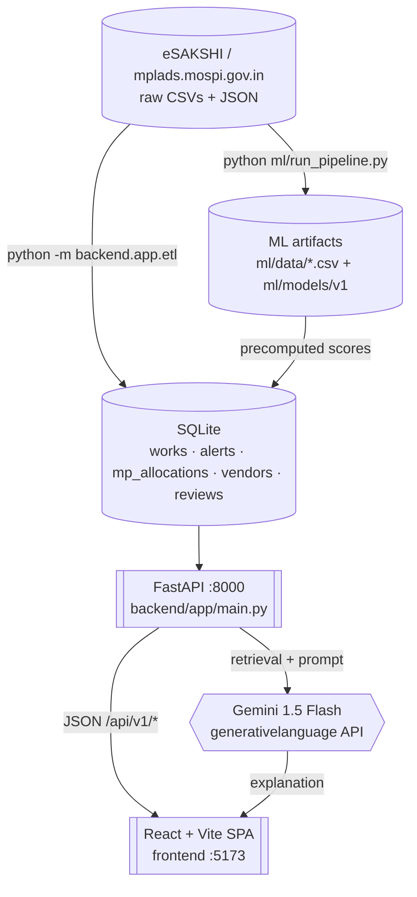
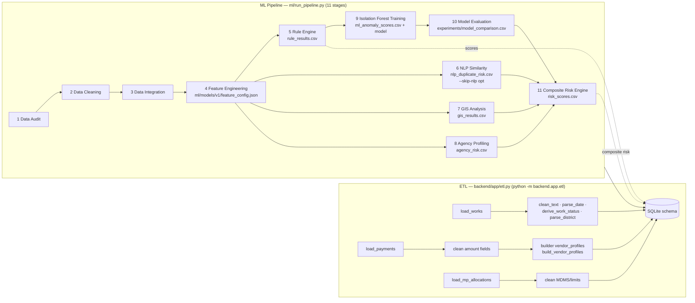
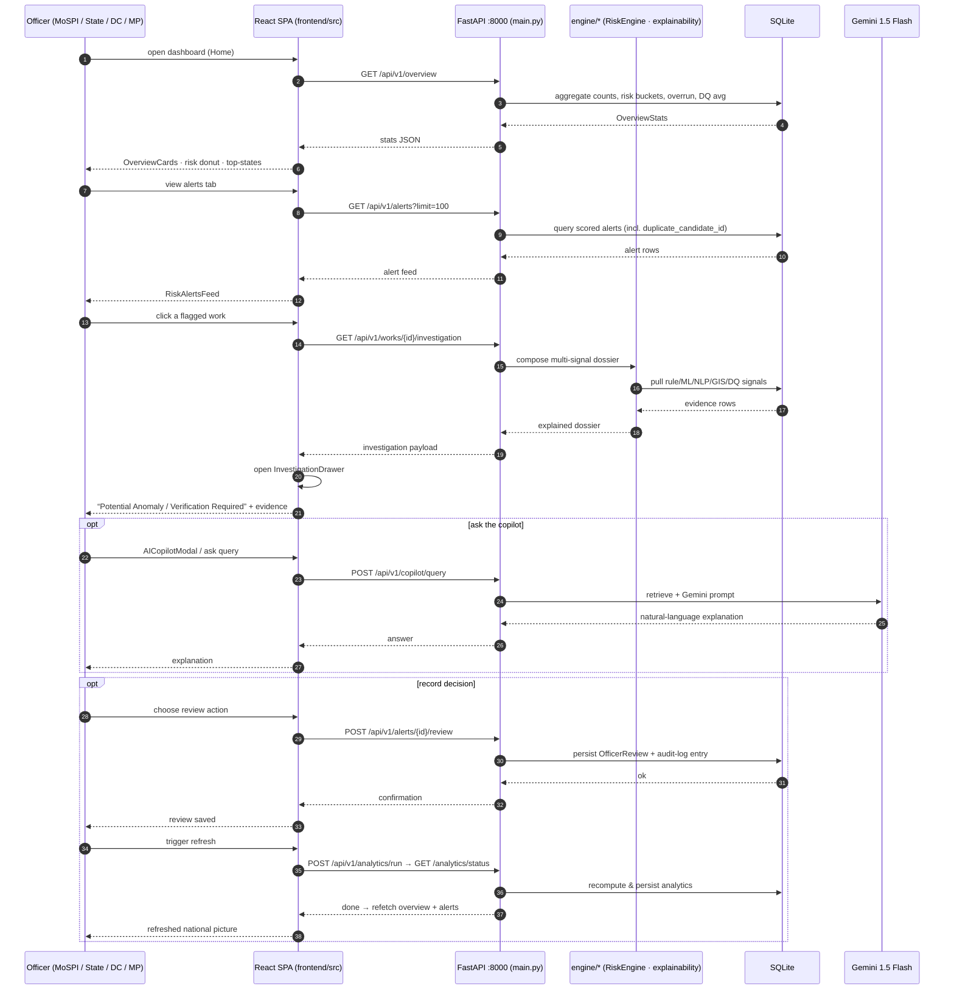
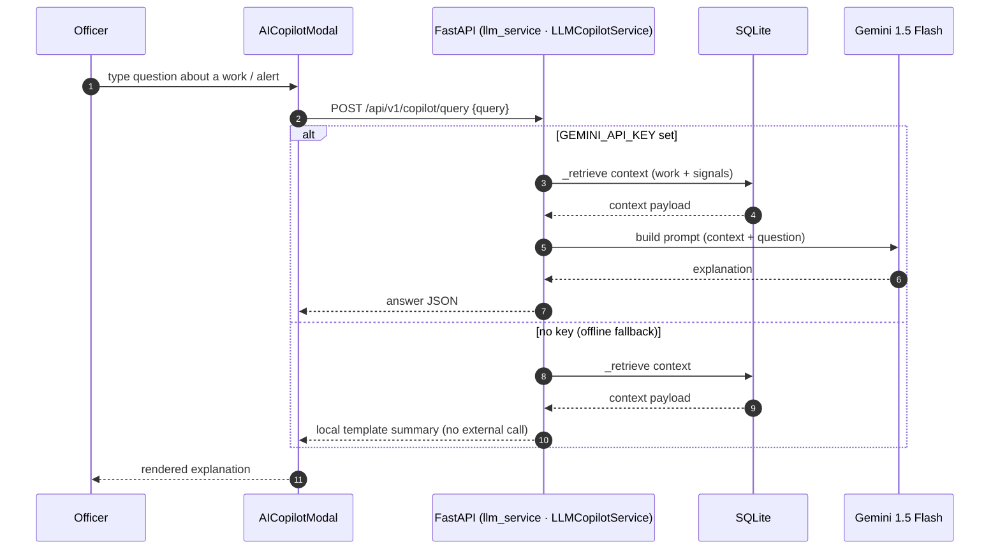

# MPLADS AI Platform — System Workflow (Mermaid)

> Grounded in the live codebase. Diagrams render on GitHub / any Mermaid-capable viewer.
> Module/endpoint file references: `backend/app/main.py`, `backend/app/etl.py`,
> `ml/run_pipeline.py`, `backend/app/engine/*`, `frontend/src/*`, `frontend/src/apiConfig.js`.

## 1. System Context



---

## 2. Offline Ingestion & ML Pipeline

Two offline jobs both feed SQLite. The ML pipeline runs 11 stages; two are skippable
(`--skip-audit`, `--skip-nlp`). Startup then reads only the precomputed DB.



---

## 3. Service-Layer Runtime (API) & Risk Aggregation

The FastAPI app (backend/app/main.py) pre-instantiates `RiskEngine` and
`LLMCopilotService`. Analytics results are persisted in SQLite from ETL; `/analytics/run`
re-runs on demand.

```mermaid
flowchart TB
    REQ[Incoming HTTP request<br/>/api/v1/*]
    REQ --> ROUTE{Route dispatcher}

    ROUTE -->|/health| H[health check: counts]
    ROUTE -->|/overview| OV[OverviewStats SQL aggregates<br/>risk/bucket counts, overrun, DQ avg]
    ROUTE -->|/works · /works/{id}| WK[Work queries]
    ROUTE -->|/works/{id}/investigation| INV[Investigation dossier<br/>multi-signal evidence]
    ROUTE -->|/alerts| AL[Scored alert feed]
    ROUTE -->|/alerts/{id}/review| RV[Persist OfficerReview<br/>+ audit-log entry]
    ROUTE -->|/audit-logs · /geo/risk-zones ·<br/>/agencies · /vendors/top · /mps/allocated-limits| AGG[Aggregate views]
    ROUTE -->|/analytics/run| AN[Recompute analytics job]
    ROUTE -->|/copilot/query| CP[LLM copilot]

    H --> DB[(SQLite)]
    OV --> DB
    WK --> DB
    AL --> DB
    RV --> DB
    AGG --> DB
    AN --> DB
    CP --> LLM{{Gemini 1.5 Flash}}
    INV --> ENG[engine: rule_engine · ml_anomaly ·<br/>nlp_duplicate · agency_risk · explainability]
    ENG --> DB
```

---

## 4. Officer Interaction Loop (verification-first)

The core value loop: scan → drill → read evidence → decide → refresh. Framed as
"Potential Anomaly / Verification Required", never accusation.

```mermaid
flowchart TB
    OFF[MoSPI officer / State Nodal / DC / MP office] -->|open dashboard| SCAN
    SCAN[1. Scan national risk<br/>OverviewCards · risk donut · top-states<br/>GET /overview] --> FEED
    FEED[2. Triage alerts feed<br/>GET /alerts?limit=100] --> DRILL
    DRILL[3. Drill into a flagged work<br/>InvestigationDrawer<br/>GET /works/{id}/investigation] --> EVID
    EVID[4. Read multi-signal evidence<br/>explainability: rule + ML + NLP + GIS + DQ]
    EVID --> DM{Verify?}
    DM -->|actions| RV[5. Record OfficerReview<br/>POST /alerts/{id}/review]
    ---> REFRESH[6. Re-run analytics<br/>POST /analytics/run · GET /analytics/status]
    REFRESH --> SCAN

    DM -->|“ask the copilot”| COP[7. AI copilot explains<br/>POST /copilot/query → Gemini]
    COP --> EVID
```

---

## 5. Frontend → Backend Contract

Each view/tab maps to the endpoint(s) it fetches (traced from `App.jsx` + `apiConfig.js`).

```mermaid
flowchart LR
    subgraph UI[React SPA — frontend/src/components]
        HERO[HeroLanding]
        CHARTS[DashboardCharts]
        FEED2[RiskAlertsFeed]
        MAP[GeoRiskMap]
        AG[AgencyRiskMatrix]
        MPS[MPAllocatedLimitsTable]
        INV2[InvestigationDrawer]
        COP2[AICopilotModal]
        HEADER[Header · refresh/persona]
    end

    HERO --> OV[GET /overview]
    CHARTS --> OV
    FEED2 --> AL[GET /alerts]
    MAP --> GEO[GET /geo/risk-zones]
    AG --> AGG[GET /agencies]
    MPS --> LIM[GET /mps/allocated-limits]
    INV2 --> I[GET /works/{id}/investigation]
    INV2 --> RV2[POST /alerts/{id}/review]
    COP2 --> C[POST /copilot/query]
    HEADER --> RUN[POST /analytics/run]

    OV & AL & GEO & AGG & LIM & I & C & RUN --> API{{FastAPI :8000}}
```

---

## 6. Sequence Diagrams — Request Lifecycles

### 6a. Officer drill-down & review (core verification lifecycle)



### 6b. LLM copilot query (retrieval + generate)



---

## 7. Decision Points & Edge Cases

- **Risk bucketing**: rule + ML + NLP + GIS + DQ signals → `Composite Risk Engine` → one of
  Low / Medium / High / Critical; never an accusation, always “verification required”.
- **Duplicate gating**: `nlp_duplicate_risk.csv` marks *candidates*, surfaced only in
  `/alerts` when `duplicate_candidate_id` is set.
- **DB not built**: startup raises `RuntimeError` → run `python -m backend.app.etl` first
  (`main.py` startup_event).
- **Partner LLM absent**: `GEMINI_API_KEY` unset → copilot degrades to retrieval-only local
  summaries (no external call).
- **Analytics re-run**: `POST /analytics/run` recomputes in-memory job state; results
  persist back to SQLite; frontend refetches overview+alerts after completion.
- **Data-quality gaps**: per-work `data_quality_score` feeds explainability and flags
  low-confidence signals rather than suppressing them.
