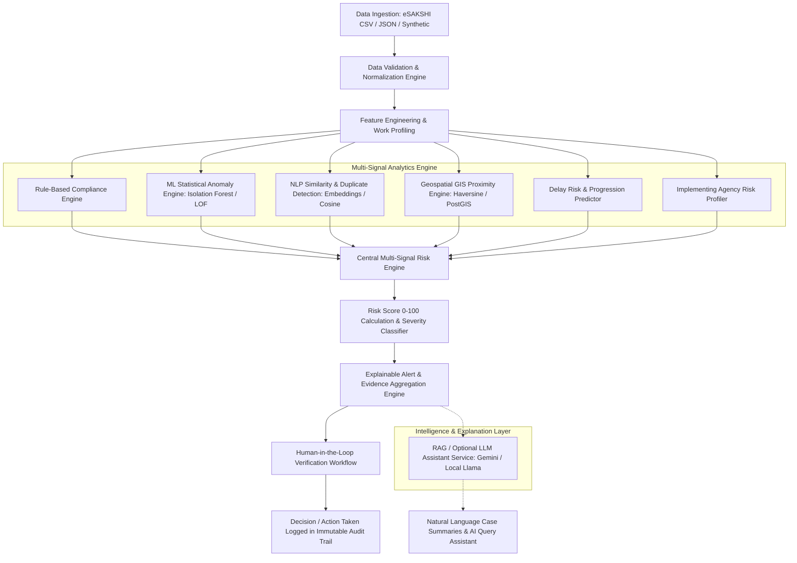

# Implementation Blueprint — SIH 2026 PS-102: AI-Powered MPLADS Anomaly, Fraud & Inefficiency Detection Platform

## Executive Summary & System Overview

This implementation blueprint establishes the architecture, data strategy, AI/ML pipeline, and user interface for an **AI-powered monitoring, anomaly detection, and risk-analysis layer** for the **Members of Parliament Local Area Development Scheme (MPLADS)**, benchmarked against the official **eSAKSHI digital portal** (`https://mplads.mospi.gov.in/`).

Rather than replacing or duplicating existing government dashboards, this platform acts as an **intelligent analytical decision-support overlay**. It processes work recommendations, sanctions, expenditures, vendor payments, physical/financial progress, geographic location, and implementing agency histories to detect anomalies, potential fraud, cost overruns, duplicate works, and progress delays.

> [!IMPORTANT]
> **Key Operational Philosophy**: The platform **NEVER** issues automated accusations of "Fraud". All findings are scored and classified as **"Potential Anomaly / Verification Required"** with multi-signal evidence, serving to guide government officials on where to direct field verification and audit resources first.

---

## Existing Government Data Ecosystem & Access Analysis

Based on empirical inspection of the live eSAKSHI dashboard (`mplads.mospi.gov.in`):

| Classification | Data Category & Description | Ingestion / Integration Strategy |
| :--- | :--- | :--- |
| 🟢 **Confirmed Accessible Data** | Public aggregate metrics (Tenure, State, Lok/Rajya Sabha, Constituency, MP profiles, Total Recommended, Sanctioned, Completed amounts). | Public snapshot ingestion & synthetic extrapolation aligned with official eSAKSHI statistics. |
| 🟡 **Potentially Accessible (Auth Required)** | Work descriptions, itemized vendor payment requests, sanction orders, uploaded asset photographs, stage-wise physical progress logs. | Accessible via authorized government department credentials or secure backend data feeds in production. |
| 🔴 **Unavailable / Unverified Data** | Automated public REST APIs or raw real-time SQL database feeds. | **No government API is assumed or fabricated.** Synthetic realistic data generation will be implemented for prototype testing. |

---

## System Conceptual Architecture

---

## User Review Required

> [!IMPORTANT]
> **Key Architecture Decisions for Approval**:
> 1. **Synthetic Data Pipeline**: We will construct a realistic 1,000+ record dataset adhering to eSAKSHI guidelines (with 15% pre-injected explainable anomalies for precision/recall validation).
> 2. **Hybrid Intelligence Stack**: Rules + Scikit-Learn Isolation Forest + Sentence-Transformers TF-IDF/embeddings + Geospatial Proximity + Deterministic Multi-Signal Risk Matrix + Optional LLM RAG provider interface.
> 3. **Single-Page Dynamic Dashboard with Multi-Stakeholder Views**: Supporting Ministry, State Nodal Authority, District Authority, and MP persona views with deep-dive Investigation Drawers.

---

## Open Questions

> [!NOTE]
> None at present. The requirements and architecture are fully scoped for the SIH 2026 demonstration.

---

## Proposed System Components & Implementation Plan

### 1. Data Schema & Ingestion Layer
#### [NEW] `backend/app/schemas/mplads.py`
Defines Pydantic data schemas representing the full MPLADS eSAKSHI lifecycle:
- **Core Entities**: `Work`, `Sanction`, `Expenditure`, `Payment`, `ImplementingAgency`, `ProgressLog`, `AssetLocation`, `RiskAlert`, `AuditTrail`.
- **Key Work Attributes**:
  - `work_id`: Unique identifier (e.g. `MPL-2024-WB-0042`)
  - `state`, `district`, `constituency`, `mp_name`, `house` (Lok Sabha / Rajya Sabha)
  - `work_category` (e.g. Sanitation, Roads, Water, Education, Community Halls)
  - `work_description`: Detailed textual description
  - `recommendation_date`, `sanction_date`, `start_date`, `expected_completion_date`, `actual_completion_date`
  - `estimated_cost`, `sanctioned_amount`, `expenditure`
  - `implementing_agency_id`, `implementing_agency_name`
  - `work_status` (Recommended, Sanctioned, In Progress, Completed, Suspended)
  - `physical_progress_pct` (0-100), `financial_progress_pct` (0-100)
  - `latitude`, `longitude`, `geo_tagged_photo_count`

#### [NEW] `scripts/generate_synthetic_data.py`
Generator script to produce `mplads_synthetic_dataset.json` / `csv`:
- Generates 1,000 realistic records spanning 10 States, 30 Districts, 50 Constituencies.
- Injects labeled anomaly test cases (Ground Truth Labels for evaluation):
  1. **Cost Anomaly**: Work cost 300% higher than category mean in same district.
  2. **Financial vs. Physical Mismatch**: 90% expenditure released with only 15% physical progress.
  3. **Duplicate / Near-Duplicate Works**: Highly similar description (e.g., "Construction of Community Center at Ward 4" vs "Building of Community Hall in Ward 4") located within 200m radius.
  4. **Timeline Anomaly**: Completion date preceding sanction date or severe unexplained delay (>365 days past expected completion).
  5. **Unusual Spending Velocity**: 80% expenditure released in final 3 days of financial year.
  6. **Agency Concentration Risk**: Single agency assigned 40+ simultaneous projects with 60% delay rate.

---

### 2. Analytics & AI Engine Component

#### [NEW] `backend/app/engine/rule_engine.py`
Configurable rule evaluation engine checking compliance rules:
- `RULE_01_EXP_EXCEEDS_SANCTION`: Expenditure > Sanctioned Amount.
- `RULE_02_PROGRESS_MISMATCH`: Financial Progress - Physical Progress > 35%.
- `RULE_03_INVALID_TIMELINE`: Sanction Date < Recommendation Date OR Completion Date < Sanction Date.
- `RULE_04_EXCESSIVE_DELAY`: Current Date > Expected Completion Date + 180 days with Physical Progress < 50%.
- `RULE_05_MISSING_MANDATORY_DOCS`: Financial progress > 50% with 0 uploaded photographs.

#### [NEW] `backend/app/engine/ml_anomaly.py`
Unsupervised Machine Learning Anomaly Detection:
- Uses **Isolation Forest** & **Local Outlier Factor (LOF)** trained on numerical features:
  - `cost_deviation_ratio` = (Estimated Cost / Category Mean Cost)
  - `spending_velocity` = Expenditure / (Days since start + 1)
  - `financial_physical_gap` = Financial Progress % - Physical Progress %
  - `duration_ratio` = Actual or Elapsed Days / Expected Days
  - `agency_active_workload`
- Outputs an ML Anomaly Probability & Anomaly Score (-1 Outlier, 1 Normal).

#### [NEW] `backend/app/engine/nlp_duplicate.py`
Textual Similarity & Duplicate Work Detection:
- **Baseline**: TF-IDF N-gram matrix with Cosine Similarity.
- **Enhanced Vector Search**: `sentence-transformers` embedding cosine similarity.
- Combines text similarity score + geographic distance + cost delta to compute a composite `duplicate_probability`.

#### [NEW] `backend/app/engine/gis_proximity.py`
Geospatial Proximity & Clustering Engine:
- Uses **Haversine Proximity Calculation** (and optional GeoPandas spatial indexing).
- Identifies works within 100m, 500m, 1km radius of existing/completed works.
- Flags suspicious spatial co-location of duplicate recommendations.

#### [NEW] `backend/app/engine/risk_engine.py`
Central Multi-Signal Risk Engine combining weighted signals:
$$\text{Risk Score} = w_1 \cdot S_{\text{rule}} + w_2 \cdot S_{\text{ml}} + w_3 \cdot S_{\text{duplicate}} + w_4 \cdot S_{\text{delay}} + w_5 \cdot S_{\text{agency}} + w_6 \cdot S_{\text{cost}}$$
- **Configurable Risk Thresholds**:
  - `0 – 25`: Low Risk
  - `26 – 50`: Medium Risk
  - `51 – 75`: High Risk
  - `76 – 100`: Critical Risk (Triggers Automatic Priority Alert)

#### [NEW] `backend/app/engine/explainability.py`
Generates human-readable, evidence-backed alert explanations:
- Summarizes exact triggering thresholds, comparative metrics, distance metrics, and risk factors.
- Formats evidence cards for decision-support UI.

#### [NEW] `backend/app/services/llm_service.py`
Optional Intelligence & Natural Language Interface:
- Abstract provider pattern supporting local models (Ollama/Llama) and cloud APIs (Google Gemini API).
- Implements RAG over structured work & risk evidence to answer natural language queries (e.g. *"Show high-risk works in District Nadia with financial progress mismatch"*).

---

### 3. Backend API Services (FastAPI)

#### [NEW] `backend/app/main.py` & `backend/app/api/`
FastAPI REST API implementation:
- `POST /api/v1/auth/login`: Mock RBAC JWT authentication (Roles: Ministry, State Authority, District Collector, MP).
- `GET /api/v1/works`: Filtered list of works with risk scores, categories, state, district.
- `GET /api/v1/works/{work_id}`: Full detailed view of a work record.
- `GET /api/v1/works/{work_id}/investigation`: Comprehensive investigation dossier.
- `GET /api/v1/alerts`: Paginated list of generated risk alerts with filter parameters.
- `POST /api/v1/alerts/{alert_id}/review`: Human-in-the-loop review submission (Accept, Dismiss, Escalate, Add Remark).
- `POST /api/v1/analytics/run`: Re-execute the multi-signal detection pipeline on new/updated datasets.
- `POST /api/v1/copilot/query`: LLM RAG natural language investigation assistant endpoint.

---

### 4. Interactive Dashboard & UI System (React + Vite + Vanilla CSS / Modern Visual Design)

#### [NEW] `frontend/src/`
Modern, high-fidelity government executive decision-support dashboard:
- **Design Aesthetic**: Premium dark/light glassmorphic UI, rich color palette (Navy Blue, Slate, Emerald Green, Amber, Crimson for risk levels), crisp typography (Inter/Montserrat).
- **Core Views**:
  1. **Executive Overview Dashboard**: KPI Cards (Total Works, Total Expenditure, High-Risk Anomaly Count, Savings at Risk), Risk Distribution Charts, Geographic Map View.
  2. **Risk Intelligence & Alert Feed**: Filterable table/cards of works sorted by Risk Score, with category filters (Cost Anomaly, Duplicate Work, Physical/Financial Gap, Delays).
  3. **Work Investigation Drawer / View**:
     - Deep-dive panel displaying financial timeline vs physical progress bar.
     - Side-by-side duplicate work comparison tool.
     - Interactive GIS leaflet map showing nearby assets.
     - Evidence breakdown card & AI natural-language summary.
     - Human-in-the-loop verification form (Audit trail logging).
  4. **Agency Risk Matrix**: Analytics table profiling performance and risk scores of all Implementing Agencies.
  5. **AI Investigation Copilot**: Interactive chat overlay to query the database using natural language.

---

## Verification Plan

### Automated Tests
1. **Data Pipeline & Validation**: Run test suite verifying data validation logic, missing field checks, and anomaly injection accuracy.
   - Command: `python -m pytest backend/tests/test_data_validation.py`
2. **AI Anomaly & Risk Engine Evaluation**: Test Isolation Forest, Rule Engine, and NLP similarity pipeline on labeled synthetic ground truth dataset.
   - Command: `python -m pytest backend/tests/test_risk_engine.py`
   - Calculate & log metrics: Precision, Recall, F1 Score, Detection Rate.
3. **Backend API Endpoints**: Test FastAPI routes for works, alerts, reviews, and analytics.
   - Command: `python -m pytest backend/tests/test_api.py`

### Manual Verification
1. **Full End-to-End Walkthrough**:
   - Start FastAPI backend server and Vite frontend dashboard.
   - Access dashboard, switch persona views (Ministry vs District Authority).
   - Inspect top critical risk alert (e.g. `MPL-2024-WB-0042`).
   - Verify that evidence explanation highlights cost anomaly, financial gap, and duplicate candidate.
   - Submit an officer review remark ("Escalated for physical site inspection").
   - Verify action is permanently logged in the audit trail.
